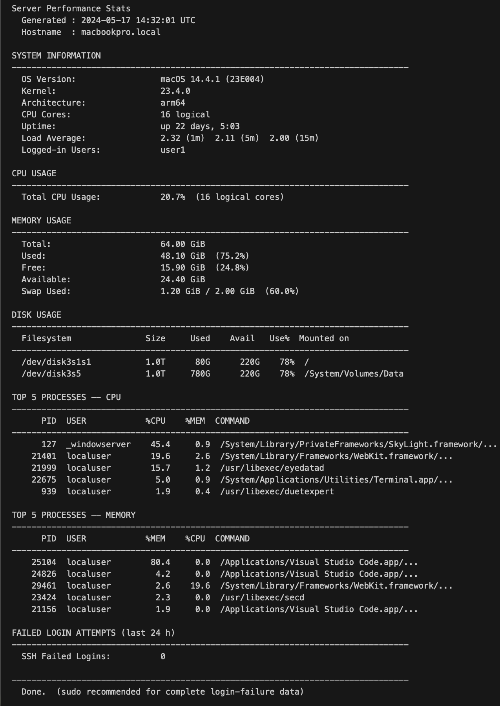

# server-stats-script.cmd


<<<<<<< HEAD

=======


>>>>>>> af4673c (feat: add native Windows support via polyglot architecture)

A lightweight, dependency-free polyglot script that analyses core server performance metrics at a glance. Runs natively on Linux, macOS, and Windows — no package installs required.

---

## Features

| Category | Metric |
|---|---|
| **System** | OS version, kernel, architecture, uptime, load average, logged-in users |
| **CPU** | Total usage % (live delta sample), logical core count |
| **Memory** | Total / used / free / available in GiB with usage % |
| **Swap** | Used vs total with usage % |
| **Disk** | Per-filesystem size, used, available, usage % (pseudo-fs filtered) |
| **Processes** | Top 5 by CPU, top 5 by memory (commands truncated to 60 chars) |
| **Security** | Failed SSH login attempts in the last 24 hours + top offending IPs |
| **Export** | Save reports as styled HTML files for archiving or emailing |

All percentage values are colour-coded: 🟢 < 60% · 🟡 60–84% · 🔴 ≥ 85%

---

## Platform Support

| Platform | Status | Notes |
|---|---|---|
| Ubuntu / Debian | ✅ Supported | Tested on Ubuntu 22.04, 24.04 |
| RHEL / Amazon Linux | ✅ Supported | Requires `bash` |
| macOS (Catalina+) | ✅ Supported | Tested on macOS 26 (arm64) |
| Windows 10/11/Server | ✅ Supported | Native execution via PowerShell |
| WSL2 | ⚠️ Mostly works | `who` and login-failure sections may vary |
| FreeBSD / OpenBSD | ❌ Not supported | `sysctl` key names differ |

> **Requires `bash`** — do not run with `sh` or `dash`. The shebang (`#!/usr/bin/env bash`) handles this automatically when executed directly.

---

## Prerequisites

No external dependencies. The following tools are used and present by default on all supported platforms:

- `bash`
- `awk`, `grep`, `ps`, `df`, `who`, `date`, `sort`
- **Linux only:** `free`, `/proc/stat`, `/proc/loadavg`, `journalctl` (or `/var/log/auth.log`)
- **macOS only:** `sysctl`, `vm_stat`, `sw_vers`, `top`, `log`
- **Windows only:** PowerShell (pre-installed), `Get-CimInstance`, `Get-Counter`, `Get-WinEvent`

---

## Installation

```bash
git clone https://github.com/privjoesrepos/server-stats-script.git
cd server-stats-script
chmod +x server-stats-script.cmd
```

---

## Usage

```bash
# Mac / Linux (Standard run)
./server-stats-script.cmd

# Mac / Linux (Full output including complete SSH login-failure data)
sudo ./server-stats-script.cmd

# Windows (Standard run - run in Command Prompt)
server-stats-script.cmd

# Windows (Full output including failed login data - Run CMD as Administrator)
server-stats-script.cmd

# Export report to a styled HTML file (Mac / Linux)
./server-stats-script.cmd --html report.html

# Export report to a styled HTML file (Windows)
server-stats-script.cmd --html report.html
```

---

## How It Works

### CPU measurement

Rather than reading a single `top` snapshot (which reflects a lifetime average), the script samples `/proc/stat` twice with a 0.5-second interval and computes:

```
cpu% = (delta_total - delta_idle) / delta_total × 100
```

On macOS, `top -l 2 -n 0` is used — the second sample gives the live-interval idle %, avoiding the same boot-average pitfall. The idle value is extracted with a field-split loop rather than `match(s,r,arr)`, which is a GNU awk extension not supported by BSD awk.

On Windows, Get-Counter `'\Processor(_Total)\% Processor Time'` is used to sample the live CPU percentage with a 1-second interval.

### Memory (macOS)

`free` does not exist on macOS. The script uses `vm_stat` page counts × `hw.pagesize`:

- **Used** = (active + wired + compressed) pages × page size
- **Available** = (free + inactive + purgeable) pages × page size

This matches what Activity Monitor reports.

### Disk filtering

On Linux, pseudo-filesystems (`tmpfs`, `devtmpfs`, `overlay`, `/dev/loop*`) are excluded by matching against the source column. On macOS, APFS role volumes (`/System/Volumes/VM`, `Preboot`, `Update`, `xarts`, `iSCPreboot`, `Hardware`) and automount entries (`map`) are excluded, while `/System/Volumes/Data` (the main user volume) is kept.

### Process sorting

`ps aux` is piped through `sort -k3 -rn` (CPU) and `sort -k4 -rn` (memory) rather than relying on `ps` sort flags, which differ between GNU and BSD. Commands are truncated to 60 characters to keep output readable.

### Failed login detection

- **Linux (systemd):** `journalctl` filtered to `sshd.service` or `ssh.service` for the last 24 hours
- **Linux (syslog):** falls back to `/var/log/auth.log`
- **macOS:** `log show` with a predicate filter (requires `sudo`); falls back to `/var/log/system.log`
- **Windows:** Queries the Windows Security Event Log for Event ID 4625 (Failed Login) using `Get-WinEvent` (requires Administrator privileges).

### Windows Support (Polyglot Architecture)

- The script uses a polyglot design to run natively on Windows without requiring Git Bash or WSL. The file uses a .cmd extension, which Windows natively executes. The Batch layer extracts the embedded PowerShell script into a temporary file and runs it seamlessly. On Mac/Linux, the shebang (#!/usr/bin/env bash) ensures the Bash logic is executed instead, ignoring the Windows code block entirely.

### HTML Export

When the --html flag is passed, the script captures the live terminal output without breaking interactive commands. At the end of the run, it strips the ANSI colour codes, wraps the output in a dark-themed HTML template (mimicking a terminal), and writes it to the specified file. This works consistently across Linux, macOS, and Windows.

**Preview:**

